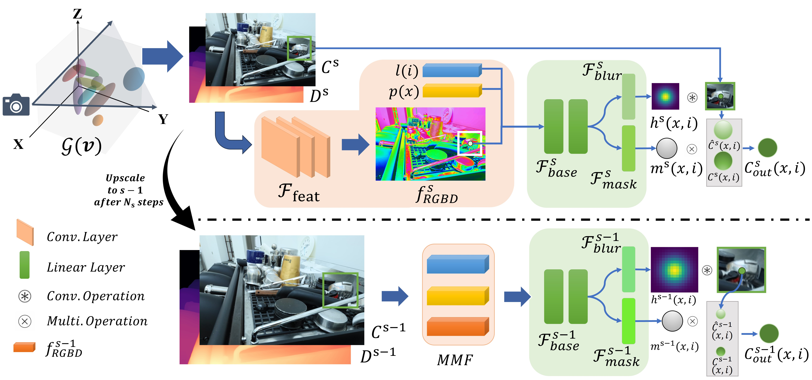

<p align="center">

  <h1 align="center">BAGS: Blur Agnostic Gaussian Splatting through Multi-Scale Kernel Modeling</h1>
  <p align="center">
    <a href="https://sites.google.com/view/cheng-peng/home">Cheng Peng*</a>
    ,
    <a href="https://github.com/snldmt/">Yutao Tang*</a>
    ,
    <a href="javascript:void(0)">Yifan Zhou</a>
    ,
    <a href="javascript:void(0)">Nengyu Wang</a>
    ,
    <a href="javascript:void(0)">Xijun Liu</a>
    ,
    <a href="javascript:void(0)">Deming Li</a>
    ,
    <a href="https://aiem.jhu.edu/lab-members/">Rama Chellappa</a>
    <br>(*Equal contribution)<br>

  </p>
  <h3 align="center"> <a href="https://arxiv.org/pdf/2403.04926.pdf">arXiv</a> | <a href="https://nwang43jhu.github.io/BAGS/">Project Page</a> </h3>
  <div align="center"></div>
</p>


This is the official implementation of the paper, [BAGS: Blur Agnostic Gaussian Splatting through Multi-Scale Kernel Modeling](https://arxiv.org/pdf/2403.04926.pdf). This is the initial version and will be updated more to match the exact performances reported in the manuscript. 


### TODO List
- [ ] Upload config files for each scene.


## Method Overview

We propose Blur Agnostic Gaussian Splatting (BAGS) which models blur by estimating per-pixel convolution kernels from a Blur Proposal Network (BPN) and is trained on top of a scene over multiple scales. We demonstrate that BAGS achieves photorealistic renderings under various challenging blur conditions, such as motion blur, defocus blur, downscaling blur, etc., and imaging geometry. Compared to previous methods, like [Deblur-NeRF](https://arxiv.org/abs/2111.14292), [DP-NeRF](https://openaccess.thecvf.com/content/CVPR2023/papers/Lee_DP-NeRF_Deblurred_Neural_Radiance_Field_With_Physical_Scene_Priors_CVPR_2023_paper.pdf), [PDRF](https://arxiv.org/abs/2208.08049), etc., BAGS significantly improves upon those approaches.


## Installation
Clone the repository and create an environment using the following commands:
```
git clone git@github.com:snldmt/BAGS.git
cd BAGS

conda create -n bags -y python=3.8
conda activate bags

pip install torch==1.12.1+cu113 torchvision==0.13.1+cu113 -f https://download.pytorch.org/whl/torch_stable.html
conda install cudatoolkit-dev=11.3 -c conda-forge

pip install -r requirements.txt

pip install submodules/diff-gaussian-rasterization
pip install submodules/simple-knn/
```

## Datasets
- Deblur-NeRF real camera motion and defocus blur datasets: download [here](https://drive.google.com/drive/folders/1_TkpcJnw504ZOWmgVTD7vWqPdzbk9Wx_).
- Mip-NeRF 360 Dataset: download [here](https://jonbarron.info/mipnerf360/).
- Unbounded Drone Dataset: to-be-uploaded.

## Training
For example, to train BAGS on **defocuscaps**, we could execute the following code:
```
gpu=0
scene=defocuscaps
llffhold=5
OMP_NUM_THREADS=4 CUDA_VISIBLE_DEVICES=${gpu} python train.py \
    -s DATAPATH/${scene} \
    -m deblurdata/${scene} \
    --init_dgt 0.0006 --iterations 46000 --ms_steps 6000 --min_opacity 0.1 \
    --eval -r 4 --port $(expr 6009 + $gpu) --kernel_size 0.1 \
    --llffhold ${llffhold}
```
We first do multi-scale traing until some user-specified steps and then we reset the learning rate and continue training on the highest scale (single-scale training).

**Explanations for some parameters:**
- **init_dgt:** we use different *densify gradient threshold* values for the multi-scale and single-scale training. This parameter specifies the value for multi-scale training.
- **min_opacity:** this parameter specifies the minimum opacity for pruning.
- **ms_steps**: controls the number of steps for multi-scale training.

## Rendering
For example, to render images for testset on **defocuscaps**, we could execute the following code:
```
scene=defocuscaps
OMP_NUM_THREADS=4 CUDA_VISIBLE_DEVICES=0 python render.py -m deblurdata/${scene} --data_device cpu --skip_train
```

## Testing
To calculate metrics, namely PSNR, SSIM, and LPIPS, we could execute the following code:
```
scene=defocuscaps
OMP_NUM_THREADS=4 CUDA_VISIBLE_DEVICES=0 python metrics.py -m deblurdata/${scene} -r 4
```


## Acknowledgements
This project is built upon [Mip-Splatting](https://github.com/autonomousvision/mip-splatting). We thank all the authors for their great work and for providing the code.


## Citation
If you find it useful for your work please cite:
```
@misc{peng2024bags,
      title={BAGS: Blur Agnostic Gaussian Splatting through Multi-Scale Kernel Modeling}, 
      author={Cheng Peng and Yutao Tang and Yifan Zhou and Nengyu Wang and Xijun Liu and Deming Li and Rama Chellappa},
      year={2024},
      eprint={2403.04926},
      archivePrefix={arXiv},
      primaryClass={cs.CV}
}
```

